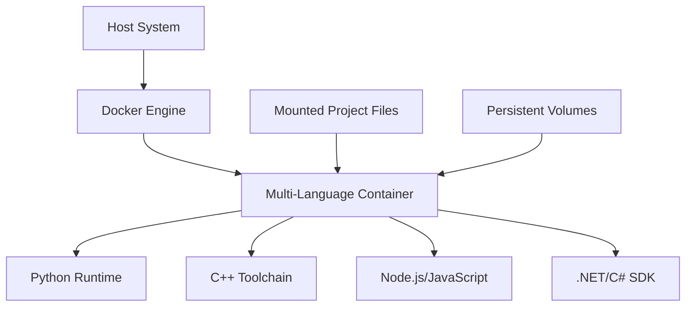

# Multi-Language Development Container

This documentation covers the Docker-based development environment configured for multi-language development following the `:ContainerizationPattern`. The setup provides a consistent, isolated, and reproducible development environment with support for Python, C++, JavaScript, and C#.

## Table of Contents

- [Overview](#overview)
- [:ContainerizationPattern Implementation](#containerizationpattern-implementation)
- [:TechnologyVersions & Rationale](#technologyversions--rationale)
- [Container Setup & Usage](#container-setup--usage)
- [:VolumeMapping Configuration](#volumemapping-configuration)
- [:EnvironmentConfiguration](#environmentconfiguration)
- [:CompatibilityIssue Mitigation](#compatibilityissue-mitigation)
- [Testing Strategy](#testing-strategy)
- [Troubleshooting](#troubleshooting)
- [Advanced Configuration](#advanced-configuration)

## Overview

The multi-language development container is designed for a project that is primarily Python-based with Flask for web components, SQL database for data storage, and market data collection functionality. It enables developers to work consistently across different environments without worrying about language-specific setup or dependency conflicts.

### Project Context

- **Primary Language**: Python
- **Database**: SQLite/SQL
- **Web Framework**: Flask
- **Main Functionality**: Market data collection and analysis

## :ContainerizationPattern Implementation

The project follows the `:ContainerizationPattern` to achieve:

1. **Isolation**: Development environment isolated from the host system
2. **Reproducibility**: Identical environment for all team members
3. **Dependency Management**: Consistent dependencies across all installations
4. **Cross-Platform Compatibility**: Works on any system supporting Docker

### Container Architecture



The architecture uses a single container approach with all language runtimes coexisting in one environment, ensuring direct interoperability while maintaining proper isolation through environment variables and path configurations.

## :TechnologyVersions & Rationale

The container includes the following technology versions:

| Technology | Version | Rationale |
|------------|---------|-----------|
| **Python** | Latest  | Core language for data processing and web services, providing maximum compatibility with current libraries |
| **C++/G++** | GNU latest | Used for performance-critical components with the standard toolchain |
| **JavaScript** | Node.js 20.x | Modern LTS release for stable web interface development |
| **C#** | .NET SDK 7.0 | Optional support for interoperability with Windows services |

### Technology Selection Considerations

- **Python**: Selected as primary language due to its rich ecosystem for data analysis and market prediction
- **C++**: Included for performance-critical algorithmic components
- **JavaScript/Node.js**: Enables modern web interface development
- **C# (.NET)**: Provides interoperability with enterprise systems

## Container Setup & Usage

### Prerequisites

- Docker installed on your host machine
- Docker Compose installed on your host machine
- Git (for cloning the repository)

### Building and Starting the Container

1. **Clone the repository**:
   ```bash
   git clone <repository-url>
   cd <repository-directory>
   ```

2. **Build and start the container**:
   ```bash
   docker-compose up -d
   ```
   This command:
   - Builds the container image based on the Dockerfile
   - Creates and starts the container in detached mode
   - Sets up all defined volumes
   - Configures the environment variables

3. **Verify container status**:
   ```bash
   docker ps
   ```
   You should see `multi-lang-dev` running.

### Accessing the Container

#### Interactive Shell Access

```bash
docker exec -it multi-lang-dev bash
```

#### Running Commands Directly

```bash
docker exec multi-lang-dev python /app/your_script.py
```

### Stopping the Container

```bash
docker-compose down
```

To remove volumes as well:
```bash
docker-compose down -v
```

## :VolumeMapping Configuration

The Docker Compose configuration implements `:VolumeMapping` for data persistence through several volume types:

### Named Volumes

| Volume Name | Container Path | Purpose |
|-------------|---------------|---------|
| `db-data` | `/app/db` | Persistent database storage |
| `market-data` | `/app/data/market` | Market data storage |
| `pip-cache` | `/root/.cache/pip` | Cache for Python packages |

### Bind Mounts

| Host Path | Container Path | Purpose |
|-----------|---------------|---------|
| Project directory (`.`) | `/app` | Development files |

### Volume Configuration Benefits

- **Data Persistence**: Database and collected market data survive container restarts
- **Development Workflow**: Changes to code on host are immediately available in container
- **Build Optimization**: Package caching speeds up rebuilds

## :EnvironmentConfiguration

The container is configured with specific environment variables to optimize the development experience:

### Development-Specific Settings

```yaml
environment:
  - FLASK_APP=server.py
  - FLASK_ENV=development
  - FLASK_DEBUG=1
  - PYTHONPATH=/app
  - PYTHONDONTWRITEBYTECODE=1
  - PYTHONUNBUFFERED=1
```

### Language Runtime Configurations

- **Python**: 
  - `PYTHONPATH=/app:${PYTHONPATH}` - Makes Python modules importable from any subdirectory
  - `PYTHONDONTWRITEBYTECODE=1` - Prevents creation of .pyc files
  - `PYTHONUNBUFFERED=1` - Ensures Python output is sent directly to terminal

- **Node.js**: 
  - `PATH="/app/node_modules/.bin:${PATH}"` - Makes installed Node.js tools available

- **C#**: 
  - `DOTNET_ROOT="/usr/share/dotnet"` - Sets .NET SDK location

### Port Exposures

| Port | Service |
|------|---------|
| 5000 | Flask web application |
| 8000 | Additional service |
| 8080 | Additional service |

## :CompatibilityIssue Mitigation

The container configuration addresses several potential compatibility issues:

### 1. Language Runtime Conflicts

| Potential Issue | Mitigation Strategy |
|-----------------|---------------------|
| **Path collisions** | Each language has dedicated PATH settings |
| **Library conflicts** | Isolated package managers (pip, npm, NuGet) |
| **Dependency conflicts** | Separate installation processes for each runtime |

### 2. File System Concerns

| Potential Issue | Mitigation Strategy |
|-----------------|---------------------|
| **Permission issues** | Volume mapping with appropriate permissions |
| **File encoding problems** | UTF-8 enforced via LANG and LC_ALL settings |
| **Line ending issues** | Git config recommendations for cross-platform development |

### 3. Port Conflicts

| Potential Issue | Mitigation Strategy |
|-----------------|---------------------|
| **Service port conflicts** | Explicit port mapping with host binding options |
| **Multiple services on same port** | Container networking isolation |

## Testing Strategy

The multi-language container supports a comprehensive testing approach:

### Cumulative Testing

The container enables cumulative testing of the entire stack:

1. **Unit Tests**: Run language-specific test frameworks (pytest for Python, jest for JavaScript)
2. **Integration Tests**: Test interactions between components written in different languages
3. **System Tests**: Validate the entire system behavior through exposed ports

#### Example Test Sequence

```bash
# Run Python tests
docker exec multi-lang-dev pytest /app/tests/

# Run Node.js tests
docker exec multi-lang-dev npm test

# Run C# tests
docker exec multi-lang-dev dotnet test
```

### Testing Stability Considerations

- Container ensures consistent testing environment across all developers and CI/CD systems
- Volume mapping allows tests to access persistent data when needed
- Environment variables are preconfigured for testing in development mode

## Troubleshooting

### Common Issues and Solutions

#### Container Won't Start

**Problem**: The container fails to start.
**Checking**: View logs with `docker-compose logs`
**Solutions**:
- Verify Docker service is running on your host
- Check for port conflicts with `netstat -tuln`
- Ensure you have proper permissions on the project directory

#### Dependency Installation Issues

**Problem**: New dependencies fail to install.
**Solutions**:
- Rebuild the container: `docker-compose build --no-cache`
- Check internet connection (proxies, firewalls)
- Verify compatibility between package versions

#### Permission Problems

**Problem**: Permission denied when accessing mounted volumes.
**Solutions**:
- Check host directory permissions
- For Linux hosts: `sudo chown -R $(id -u):$(id -g) .`
- Consider adding a non-root user to the container

#### Slow Container Performance

**Problem**: The container runs slowly.
**Solutions**:
- Increase Docker resource allocation in Docker Desktop settings
- Check host system resource usage
- Prune unused Docker resources: `docker system prune`

### Resetting the Environment

If you encounter persistent issues, you can reset the environment:

```bash
# Stop and remove the container
docker-compose down

# Remove container image
docker rmi $(docker images -q multi-lang-dev)

# Optional: remove volumes if you want to reset all data
docker volume rm $(docker volume ls -q | grep -E 'base_server_01_(db-data|market-data|pip-cache)')

# Rebuild and start container
docker-compose up -d --build
```

## Advanced Configuration

### Adding Python Packages

1. **Update `requirements.txt`** with new packages
2. **Rebuild the container**:
   ```bash
   docker-compose build
   ```
   Or install directly in the running container:
   ```bash
   docker exec multi-lang-dev pip install package-name
   ```

### Adding Node.js Packages

```bash
docker exec -it multi-lang-dev bash
cd /path/to/js/project
npm install --save package-name
```

### Configuring C++ Build Environment

The container includes CMake and build essentials. For a C++ project:

```bash
docker exec -it multi-lang-dev bash
cd /app/cpp_project
mkdir build && cd build
cmake ..
make
```

### Using C# (.NET Core)

```bash
docker exec -it multi-lang-dev bash
cd /app/csharp_project
dotnet build
dotnet run
```

### Customizing the Container

To modify the container configuration:

1. Edit the `Dockerfile` or `docker-compose.yml`
2. Rebuild the container:
   ```bash
   docker-compose down
   docker-compose up -d --build