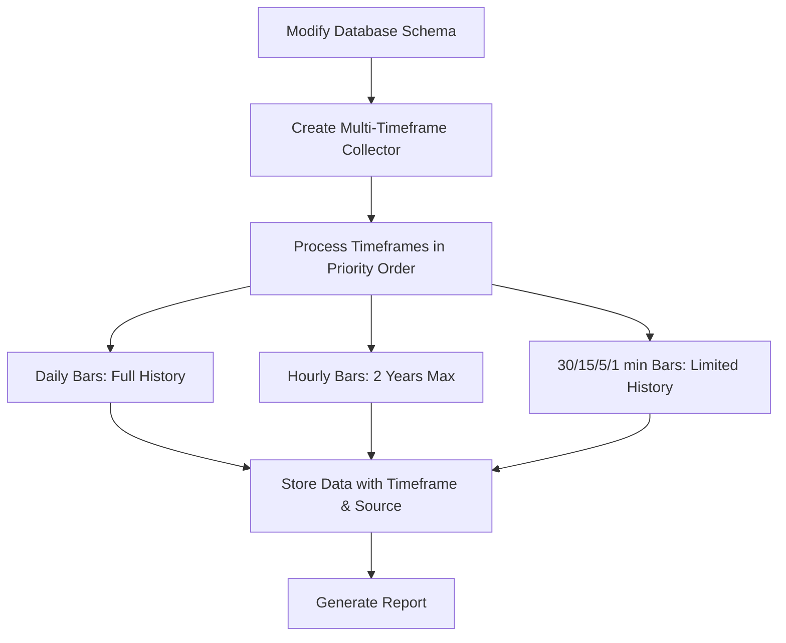

# Market Data Collection Plan for Multiple Timeframes and API Sources

## Overview

This document outlines the plan for collecting OHLC market data for multiple symbols across different timeframes and storing it in the PostgreSQL database. The implementation is designed to handle different data sources, starting with Yahoo Finance but allowing for future API integrations.

## Symbols to Collect

- `^GSPC` (S&P 500)
- `^VIX` (Volatility Index)
- `^VXN` (Nasdaq Volatility Index)
- `^SKEW` (CBOE SKEW Index)
- `^VVIX` (VIX Volatility Index)
- `^TNX` (10-Year Treasury Yield)
- `^NDX` (Nasdaq 100)
- `^RUT` (Russell 2000)
- `CL=F` (Crude Oil Futures)
- `GC=F` (Gold Futures)
- `HG=F` (Copper Futures)

## Timeframes to Collect

- `1min` (1-minute bars)
- `5min` (5-minute bars)
- `15min` (15-minute bars)
- `30min` (30-minute bars)
- `60min` (1-hour bars)
- `1day` (daily bars)

## Implementation Plan



### 1. Database Schema Modifications

The current schema needs to be updated to support multiple timeframes and data sources:

```sql
-- Modify price_data table to add timeframe and data_source columns
ALTER TABLE price_data 
ADD COLUMN timeframe VARCHAR(20) NOT NULL DEFAULT '1day',
ADD COLUMN data_source VARCHAR(50) NOT NULL DEFAULT 'yfinance';

-- Drop the existing unique constraint
ALTER TABLE price_data 
DROP CONSTRAINT unique_price_point;

-- Add a new unique constraint that includes timeframe and data_source
ALTER TABLE price_data 
ADD CONSTRAINT unique_price_point 
    UNIQUE (symbol_id, timestamp, timeframe, data_source);

-- Add index for efficient querying by timeframe
CREATE INDEX idx_price_data_timeframe 
    ON price_data USING btree (timeframe);

-- Add index for efficient querying by data source
CREATE INDEX idx_price_data_data_source 
    ON price_data USING btree (data_source);

-- Add composite index for common query patterns
CREATE INDEX idx_price_data_symbol_timeframe_time 
    ON price_data USING btree (symbol_id, timeframe, timestamp);
```

### 2. Multi-Timeframe Market Data Collector

We'll extend the existing `MarketDataCollector` class to create a specialized collector that handles multiple timeframes efficiently:

```python
class MultiTimeframeMarketDataCollector(MarketDataCollector):
    """
    Extends MarketDataCollector to support multiple timeframes with optimized
    collection strategies for each timeframe.
    """
    
    def __init__(self, config=None):
        super().__init__(config)
        
        # Configure timeframe settings
        self.timeframe_settings = {
            '1min': {
                'yf_interval': '1m',
                'max_days_history': 7,
                'batch_size': 2,
                'delay_between_symbols': 2.0  # seconds
            },
            '5min': {
                'yf_interval': '5m',
                'max_days_history': 60,
                'batch_size': 3,
                'delay_between_symbols': 1.5
            },
            '15min': {
                'yf_interval': '15m',
                'max_days_history': 60,
                'batch_size': 5,
                'delay_between_symbols': 1.0
            },
            '30min': {
                'yf_interval': '30m',
                'max_days_history': 60,
                'batch_size': 5,
                'delay_between_symbols': 1.0
            },
            '60min': {
                'yf_interval': '60m',
                'max_days_history': 730,
                'batch_size': 8,
                'delay_between_symbols': 0.5
            },
            '1day': {
                'yf_interval': '1d',
                'max_days_history': 'max',
                'batch_size': 10,
                'delay_between_symbols': 0.3
            }
        }
```

### 3. Modified Data Fetching and Storage Methods

```python
def fetch_ohlcv_data_multi_timeframe(self, symbol, timeframe, start_date, end_date=None):
    """Fetch OHLCV data for a specific symbol and timeframe"""
    
    # Get timeframe configuration
    tf_config = self.timeframe_settings.get(timeframe)
    if not tf_config:
        raise ValueError(f"Unsupported timeframe: {timeframe}")
    
    yf_interval = tf_config['yf_interval']
    
    # Call the original fetch method with proper interval
    data = self.fetch_ohlcv_data(symbol, start_date, end_date, interval=yf_interval)
    
    # Add timeframe and data_source columns
    if not data.empty:
        data['timeframe'] = timeframe
        data['data_source'] = 'yfinance'
    
    return data

def store_ohlcv_data_multi_timeframe(self, data):
    """Store OHLCV data with timeframe and data_source information"""
    
    # Modified SQL for INSERT with timeframe and data_source
    insert_query = """
        INSERT INTO price_data (
            symbol_id, timestamp, open, high, low, close, volume, 
            timeframe, data_source
        )
        VALUES (%s, %s, %s, %s, %s, %s, %s, %s, %s)
        ON CONFLICT (symbol_id, timestamp, timeframe, data_source) DO UPDATE 
        SET open = EXCLUDED.open,
            high = EXCLUDED.high,
            low = EXCLUDED.low,
            close = EXCLUDED.close,
            volume = EXCLUDED.volume,
            created_at = CURRENT_TIMESTAMP
    """
    
    # Rest of implementation following pattern of original store_ohlcv_data method
    # but includes timeframe and data_source in parameters
```

### 4. Multi-Timeframe Collection Strategy

```python
def collect_multi_timeframe_data(self, symbols, timeframes, start_date, end_date=None):
    """
    Collect data for multiple symbols across multiple timeframes.
    
    Args:
        symbols: List of symbols to collect
        timeframes: List of timeframes to collect
        start_date: Start date for collection
        end_date: End date for collection
    
    Returns:
        Dictionary with collection statistics
    """
    results = {
        'symbols_processed': 0,
        'symbols_failed': 0,
        'total_rows_collected': 0,
        'total_rows_stored': 0,
        'timeframe_stats': {},
        'errors': [],
        'started_at': datetime.datetime.now().isoformat(),
        'completed_at': None
    }
    
    # Initialize timeframe stats
    for tf in timeframes:
        results['timeframe_stats'][tf] = {
            'symbols_processed': 0,
            'rows_collected': 0,
            'rows_stored': 0
        }
    
    # Process timeframes from lowest to highest frequency
    # Daily data first, then hourly, then minute-level data
    sorted_timeframes = sorted(
        timeframes,
        key=lambda tf: self._get_timeframe_priority(tf)
    )
    
    for timeframe in sorted_timeframes:
        tf_config = self.timeframe_settings.get(timeframe)
        
        # Adjust start_date based on timeframe limitations
        if tf_config['max_days_history'] != 'max':
            max_days = tf_config['max_days_history']
            adjusted_start = max(
                datetime.datetime.strptime(start_date, '%Y-%m-%d'),
                datetime.datetime.now() - datetime.timedelta(days=max_days)
            ).strftime('%Y-%m-%d')
        else:
            adjusted_start = start_date
            
        batch_size = tf_config['batch_size']
        delay = tf_config['delay_between_symbols']
        
        # Process symbols in batches
        for i in range(0, len(symbols), batch_size):
            batch_symbols = symbols[i:i+batch_size]
            
            # Process each symbol in batch
            for symbol in batch_symbols:
                # Fetch and store data for this symbol and timeframe
                try:
                    # Fetch data
                    data = self.fetch_ohlcv_data_multi_timeframe(
                        symbol, timeframe, adjusted_start, end_date
                    )
                    
                    # Validate data
                    if not data.empty:
                        data = self.validate_data(data)
                        
                        # Store data
                        rows_stored = self.store_ohlcv_data_multi_timeframe(data)
                        
                        # Update statistics
                        results['symbols_processed'] += 1
                        results['total_rows_collected'] += len(data)
                        results['total_rows_stored'] += rows_stored
                        results['timeframe_stats'][timeframe]['symbols_processed'] += 1
                        results['timeframe_stats'][timeframe]['rows_collected'] += len(data)
                        results['timeframe_stats'][timeframe]['rows_stored'] += rows_stored
                    else:
                        # No data returned
                        results['symbols_failed'] += 1
                        results['errors'].append({
                            'symbol': symbol,
                            'timeframe': timeframe,
                            'error': 'No data returned'
                        })
                except Exception as e:
                    # Handle errors
                    results['symbols_failed'] += 1
                    results['errors'].append({
                        'symbol': symbol,
                        'timeframe': timeframe,
                        'error': str(e)
                    })
                
                # Add delay between symbols to avoid rate limits
                if delay > 0:
                    time.sleep(delay)
    
    # Return collection results
    results['completed_at'] = datetime.datetime.now().isoformat()
    return results
```

### 5. CLI Script and User Interface

Create a command-line interface script that:
- Accepts parameters for symbols, timeframes, and date ranges
- Shows progress during collection
- Generates reports on collected data

## Yahoo Finance API Limitations

- **1-minute data**: Limited to 7 days of history
- **5-minute data**: Limited to 60 days of history
- **Hourly data**: Limited to 730 days (2 years)
- **Daily data**: Available for full history (max)
- **Rate limits**: Undocumented but exist, requiring backoff strategies

## Execution Strategy

1. **Schema modifications** first to ensure proper data storage
2. **Daily data collection** first (complete history, less API intensive)
3. **Hourly data collection** next (2-year history)
4. **Minute-level data collection** last (highest API usage, limited history)
5. **Batch processing** with appropriate delays to avoid rate limiting
6. **Verification** at each step to ensure data integrity

## Future API Integration

The schema changes we've made will allow for integration with other data sources:

1. The `data_source` column will identify which API provided each datapoint
2. The unique constraint ensures no conflicts between different data sources
3. New data collectors can be created for each API following the same pattern
4. The database can be queried by data source for comparison or validation

## Implementation Checklist

- [ ] Apply database schema changes
- [ ] Create MultiTimeframeMarketDataCollector class
- [ ] Implement modified fetching and storage methods
- [ ] Create collection strategy method
- [ ] Develop CLI script for user interaction
- [ ] Test with single symbol, single timeframe
- [ ] Test with single symbol, all timeframes
- [ ] Test with all symbols, varied timeframes
- [ ] Verify data integrity
- [ ] Document implementation and usage