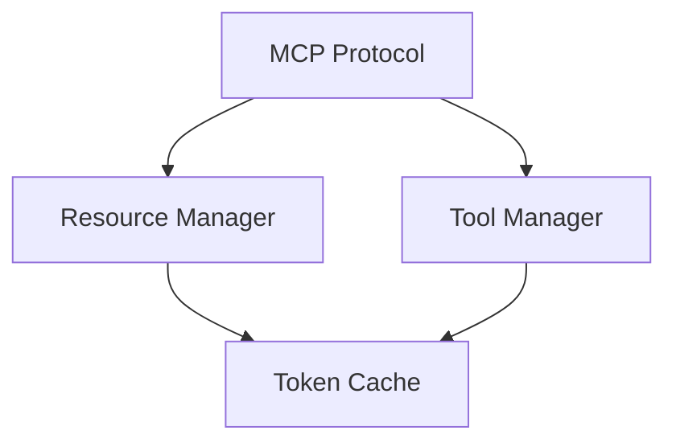

# Token-Efficient MCP Server Base Implementation

## 1. Core MCP Server Infrastructure

### 1.1 Token Optimization Principles
- Use compact data structures
- Implement lazy loading patterns
- Employ efficient serialization
- Cache frequently accessed data
- Stream large datasets

### 1.2 Base Server Components



#### Protocol Implementation
```python
class MCPServer:
    def __init__(self):
        self.resource_mgr = ResourceManager()
        self.tool_mgr = ToolManager()
        self.token_cache = TokenCache()
```

### 1.3 Token-Efficient Configuration
```json
{
  "server": {
    "cache_size": 1000,
    "batch_size": 100,
    "compression": true
  }
}
```

## 2. Resource Management

### 2.1 Resource Interface
```python
class Resource:
    def get_chunk(self, start: int, size: int) -> bytes:
        """Get resource data in chunks for token efficiency"""
        pass

    def get_metadata(self) -> dict:
        """Get compact metadata only"""
        pass
```

### 2.2 Token-Efficient Resource Types

1. StreamingResource
   - Loads data in chunks
   - Maintains small memory footprint
   - Uses generators for iteration

2. CachedResource  
   - LRU cache for hot data
   - Compressed storage
   - Automatic pruning

3. CompositeResource
   - Lazy-loaded components
   - Shared reference pools
   - Delta-based updates

## 3. Tool Management

### 3.1 Tool Interface
```python
class Tool:
    def estimate_tokens(self, input_data: dict) -> int:
        """Estimate token usage before execution"""
        pass

    def execute(self, input_data: dict) -> Iterator[dict]:
        """Stream results to control token usage"""
        pass
```

### 3.2 Token Optimization Strategies

1. Input Processing
   - Validate size limits
   - Compress large inputs
   - Filter unnecessary fields

2. Execution Pipeline
   - Stream processing
   - Batch operations
   - Early termination

3. Result Handling
   - Chunked responses
   - Progressive loading
   - Selective field inclusion

## 4. Extension Framework

### 4.1 Token-Efficient Plugin Architecture

```python
class Plugin:
    def load(self) -> None:
        """Lazy load plugin components"""
        pass

    def get_interface(self) -> dict:
        """Return minimal interface definition"""
        pass
```

### 4.2 Extension Points

1. Resource Extensions
```python
@resource_extension
class CustomResource(Resource):
    def __init__(self):
        self.data = None  # Lazy loaded
        self.metadata = {}  # Minimal metadata
```

2. Tool Extensions
```python
@tool_extension
class CustomTool(Tool):
    def execute(self, input_data: dict) -> Iterator[dict]:
        for chunk in self._process_chunks(input_data):
            yield self._optimize_chunk(chunk)
```

## 5. Token-Efficient Implementation Patterns

### 5.1 Data Structures
- Use compact representations
- Implement custom serializers
- Share common data

### 5.2 Processing Patterns
- Stream processing
- Incremental updates
- Partial loading

### 5.3 Caching Strategies
- Multi-level caching
- Predictive loading
- Smart invalidation

## 6. Feature Addition Guide

### 6.1 Token Budget Planning
1. Define token limits per operation
2. Implement monitoring
3. Set up alerts
4. Track usage patterns

### 6.2 Adding New Features
```python
# Token-efficient feature template
class NewFeature:
    def __init__(self):
        self.token_budget = 1000
        self.cache = LRUCache(100)

    def process(self, data: Iterator) -> Iterator:
        """Process data while respecting token budget"""
        tokens_used = 0
        for item in data:
            if tokens_used >= self.token_budget:
                yield TokenBudgetExceeded()
                break
            yield self._process_item(item)
            tokens_used += self._estimate_tokens(item)
```

### 6.3 Integration Guidelines

1. Resource Integration
   - Use streaming interfaces
   - Implement chunking
   - Cache effectively

2. Tool Integration
   - Respect token budgets
   - Stream results
   - Optimize payloads

## 7. Token Usage Monitoring

### 7.1 Metrics
- Tokens per request
- Cache hit rates
- Compression ratios
- Peak usage patterns

### 7.2 Optimization Triggers
- Token thresholds
- Performance targets
- Resource limits

## 8. Future Extensions

### 8.1 Planned Features
1. Advanced compression
2. Smart batching
3. Predictive loading
4. Dynamic scaling

### 8.2 Token Efficiency Roadmap
1. Implement streaming everywhere
2. Optimize serialization
3. Enhance caching
4. Add monitoring

---

## Quick Start

1. Initialize server with token budget:
```python
server = MCPServer(token_budget=10000)
```

2. Register token-efficient resource:
```python
server.register_resource(StreamingResource())
```

3. Add tool with token monitoring:
```python
server.register_tool(TokenAwareTool())
```

4. Start server with optimization:
```python
server.start(optimize_tokens=True)
```

## Token Efficiency Checklist

- [ ] Implement streaming interfaces
- [ ] Set up token monitoring
- [ ] Configure caching
- [ ] Enable compression
- [ ] Test with sample loads