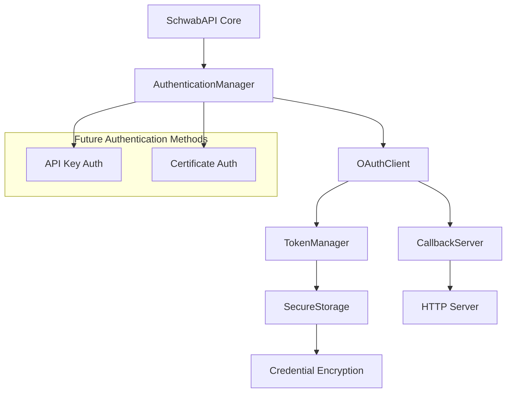
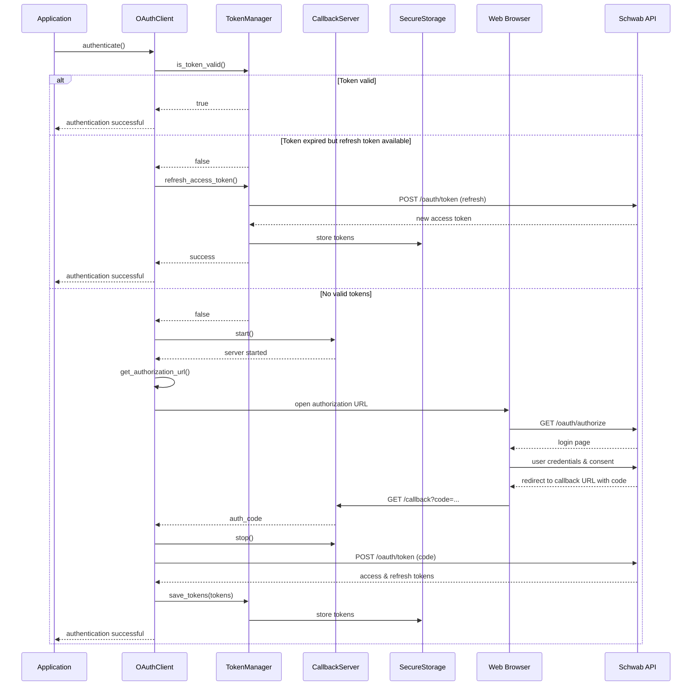

# Modular Schwab API OAuth Authentication Implementation Plan

## OAuth Authentication Architecture



## Directory Structure for Authentication Module

```
Base_Server_01/
├── schwab_api/
│   ├── auth/
│   │   ├── __init__.py             # Exports key components
│   │   ├── auth_manager.py         # Abstract authentication manager
│   │   ├── oauth/
│   │   │   ├── __init__.py
│   │   │   ├── oauth_client.py     # OAuth client implementation
│   │   │   ├── token_manager.py    # Token storage and refresh
│   │   │   └── callback_server.py  # HTTP callback server
│   │   └── exceptions.py           # Auth-specific exceptions
│   ├── config/
│   │   ├── __init__.py
│   │   ├── secure_storage.py       # Credential encryption/storage
│   │   └── settings.py             # Config settings manager
```

## Key OAuth Components

### 1. Authentication Manager (abstract)

This component defines the interface for all authentication mechanisms:

```python
class AuthenticationManager(ABC):
    """Base class for all authentication mechanisms"""
    
    @abstractmethod
    def authenticate(self):
        """Initiate the authentication flow"""
        pass
        
    @abstractmethod
    def is_authenticated(self):
        """Check if authentication is valid"""
        pass
        
    @abstractmethod
    def get_auth_headers(self):
        """Get authentication headers for requests"""
        pass
```

### 2. OAuth Client

The OAuth client implements the authentication manager interface:

```python
class OAuthClient(AuthenticationManager):
    """OAuth2 implementation for Schwab API"""
    
    def __init__(self, api_type, settings_manager, token_manager, callback_server=None):
        """Initialize with dependencies injected"""
        self.api_type = api_type  # 'market_data' or 'accounts_trading'
        self.settings = settings_manager
        self.token_manager = token_manager
        self.callback_server = callback_server or CallbackServer()
        
    def authenticate(self):
        """OAuth authentication flow with state persistence"""
        # 1. Check for existing valid token
        # 2. Try token refresh if available
        # 3. Start full OAuth flow if needed
        
    def is_authenticated(self):
        """Check if we have a valid token"""
        
    def get_auth_headers(self):
        """Get Bearer token headers"""
        
    def _get_authorization_url(self):
        """Build OAuth authorization URL"""
        
    def _exchange_code_for_token(self, auth_code):
        """Exchange auth code for tokens"""
```

### 3. Token Manager

Handles token storage, retrieval, and refresh logic:

```python
class TokenManager:
    """Manages OAuth tokens securely"""
    
    def __init__(self, secure_storage, api_type):
        self.secure_storage = secure_storage
        self.api_type = api_type
        self.access_token = None
        self.refresh_token = None
        self.token_expiry = 0
        
    def save_tokens(self, access_token, refresh_token, expires_in):
        """Save tokens securely"""
        
    def load_tokens(self):
        """Load tokens if available"""
        
    def is_token_valid(self, buffer_seconds=60):
        """Check if access token is still valid with buffer time"""
        
    def refresh_access_token(self):
        """Request a new access token using refresh token"""
```

### 4. Callback Server

Manages the OAuth callback endpoint:

```python
class CallbackServer:
    """HTTP server to handle OAuth callbacks"""
    
    def __init__(self, host='127.0.0.1', port=8000):
        self.host = host
        self.port = port
        self.server = None
        self.auth_code = None
        
    def start(self, callback_path='/callback'):
        """Start the callback server in a background thread"""
        
    def stop(self):
        """Stop the callback server"""
        
    def wait_for_callback(self, timeout=300):
        """Wait for authorization code with timeout"""
```

### 5. Secure Storage

Handles encryption and storage of sensitive data:

```python
class SecureStorage:
    """Secure storage for credentials and tokens"""
    
    def __init__(self, base_dir):
        self.base_dir = base_dir
        
    def store(self, name, data):
        """Encrypt and store data"""
        
    def retrieve(self, name):
        """Retrieve and decrypt data"""
        
    def _encrypt(self, data):
        """Encrypt data (platform specific)"""
        
    def _decrypt(self, encrypted_data):
        """Decrypt data (platform specific)"""
```

## OAuth Authentication Flow



## Security Implementation Details

### 1. Token Security

Tokens will be secured using:

1. **Encryption at Rest**: All tokens stored using platform-specific encryption:
   - Windows: `win32crypt` for CryptProtectData/CryptUnprotectData
   - Linux/Mac: AES encryption with key derived from system properties
   
2. **Memory Protection**:
   - Keep sensitive data in memory only when needed
   - Clear memory when no longer in use

3. **Token Rotation**:
   - Automatic refresh before expiration
   - Token invalidation on errors

### 2. Callback Security

1. **Local-only Binding**:
   - Bind HTTP server only to 127.0.0.1
   - Use a random port if default is unavailable
   
2. **CSRF Protection**:
   - Implement state parameter in OAuth requests
   - Validate state on callback

3. **Callback Verification**:
   - Validate callback parameters
   - Timeout for security (max wait time)

## Implementation Sequence

1. **Create Base Structure**
   - Set up directory structure
   - Create package files

2. **Implement Secure Storage**
   - Port and enhance the existing credential handling
   - Add cross-platform support
   - Add unit tests for storage

3. **Implement Token Manager**
   - Create token persistence
   - Implement refresh logic
   - Add token validation

4. **Implement Callback Server**
   - Create modular, reusable HTTP server
   - Add proper error handling
   - Implement security features

5. **Implement OAuth Client**
   - Create main OAuth implementation
   - Add auth state management
   - Implement auth flow with dependencies

6. **Create Authentication Manager**
   - Define abstract interface
   - Create factory for auth methods
   - Enable dependency injection

7. **Integration and Testing**
   - Unit tests for each component
   - Integration tests for full flow
   - Security testing

## Module Integration

The OAuth authentication module will be integrated with the core API as follows:

```python
# Example usage in application
from schwab_api.core import SchwabAPI
from schwab_api.config import SettingsManager, SecureStorage
from schwab_api.auth.oauth import OAuthClient, TokenManager, CallbackServer

# Initialize components
settings = SettingsManager()
storage = SecureStorage(base_dir="./config")
token_manager = TokenManager(storage, api_type="market_data")
callback_server = CallbackServer(port=8000)
oauth_client = OAuthClient("market_data", settings, token_manager, callback_server)

# Create API with authentication
api = SchwabAPI(auth_manager=oauth_client)

# Use API
if api.authenticate():
    quotes = api.market_data.get_quotes(["AAPL", "MSFT"])
```

## Extensibility for Future Authentication Methods

The authentication system is designed to be extensible:

1. **Abstract AuthenticationManager**: All auth methods implement the same interface
2. **Pluggable Auth Methods**: New auth methods can be added by implementing the interface
3. **Factory Pattern**: AuthenticationFactory can instantiate the appropriate auth method
4. **Configuration-Driven**: Auth method can be specified in configuration

## Error Handling Strategy

The OAuth implementation will include comprehensive error handling:

1. **Specific Exception Types**:
   - `AuthenticationError`: Base exception for all auth errors
   - `TokenError`: Issues with token management
   - `CallbackError`: Problems with callback server
   - `NetworkError`: Connection issues
   
2. **Retry Mechanisms**:
   - Automatic retry for transient errors
   - Exponential backoff for API calls
   
3. **Graceful Degradation**:
   - Fallback strategies when possible
   - Clear error reporting to application